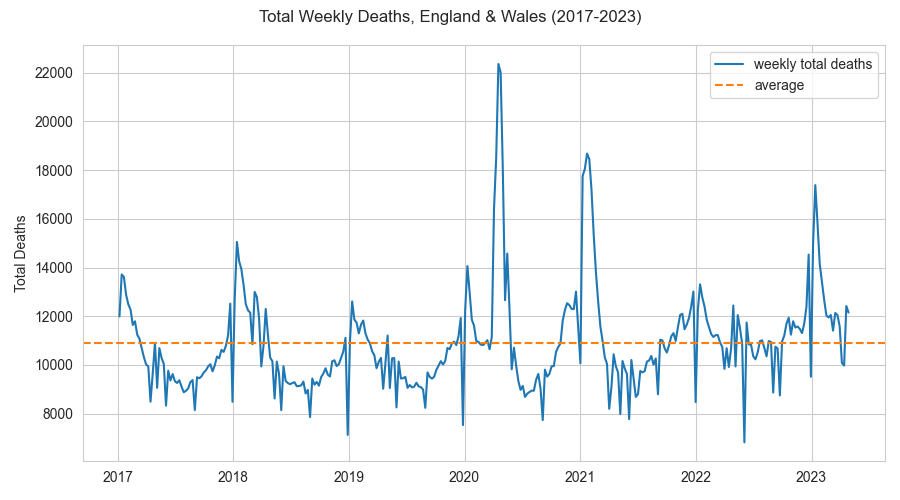
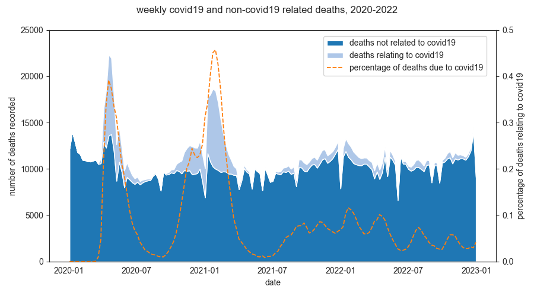
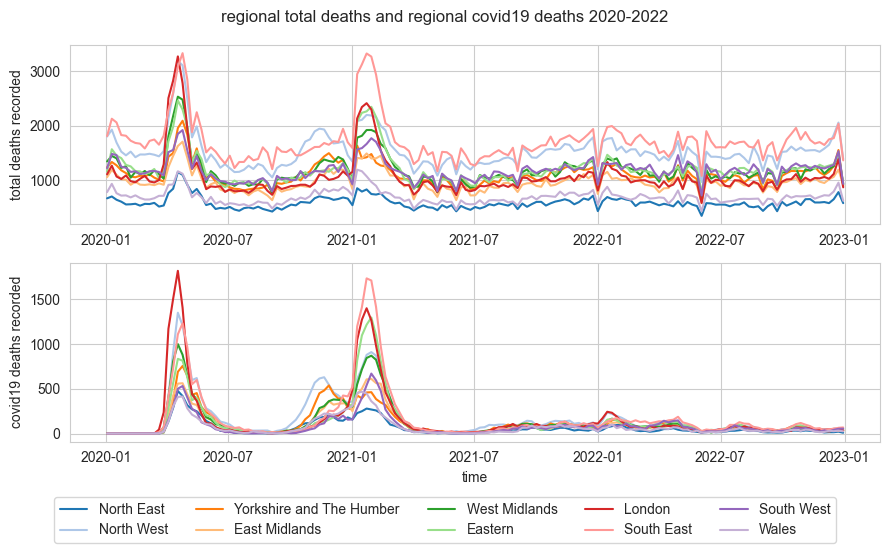

<!-- # covis
YSJ DSDA DSC6002M Data Visualisation project. -->
# Visualisations
<br>

<!-- 
 -->

### 4.1 Was there an increase in deaths per week in the UK?



### 4.2 Were the increased number of weekly deaths due to COVID-19 and how did the percentage of deaths due to COVID-19 change over time?



### 4.3 Can seasonality be seen in deaths by selected cause?


<html>
  <head>
    <script src="jquery.js"></script>
    <script>
    $(function(){
      $("#includedContent").load("output/rose_causes.html.html");
    });
    </script>
  </head>

  <body>
     <div id="includedContent"></div>
  </body>
</html>

### 4.4 Did age and sex affect one’s susceptibility to death from COVID-19 during the peak of the pandemic?


### 4.5 Was there a relationship between deaths due to COVID-19 and traffic movement?


### 4.6 How were different geographic regions of the UK affected over time?




### 4.7 Can we easily identify periods when deaths due to COVID-19 exceed a given threshold?


<!-- ---
Documentation for the covis python package is included
in the [doc](doc) folder - to view the latest version, clone this repo then run
the following:

```bash
cd <path/to/repo>/doc
make html
```

Sphinx will build the documentation under the `doc/_build` folder; point your
browser at `doc/_build/index.html` to view the pages locally. -->

---
The data used in this project is available from the Office of National Statistics and is licensed under the Open Government Licence:

[https://www.ons.gov.uk/peoplepopulationandcommunity/healthandsocialcare/conditionsanddiseases](https://www.ons.gov.uk/peoplepopulationandcommunity/healthandsocialcare/conditionsanddiseases)

(Crown copyright 2023)
<br>
<br>

Supplementary geojson files from:

[https://martinjc.github.io/UK-GeoJSON/](https://martinjc.github.io/UK-GeoJSON/)
